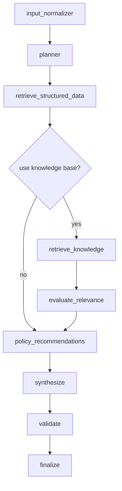

# Architecture

## System Diagram

```mermaid
flowchart LR
    Client[Canal PJ / Frontend] -->|GET /v1/assistant/{customerId}| BFA[BFA Go]
    BFA -->|parallel HTTP| Profile[Mock/Profile API]
    BFA -->|parallel HTTP| Tx[Mock/Transactions API]
    BFA -->|POST /v1/agent/analyze| Agent[Agent Service Python]
    Agent -->|RAG search| KB[(Knowledge Base + Vector Store)]
    Agent -->|optional traces| LangFuse[LangFuse]
    BFA -->|metrics| Prom[Prometheus]
    Agent -->|metrics| Prom
    Profile -->|metrics| Prom
    BFA -->|OTLP traces| OTel[OTEL Collector]
    Agent -->|OTLP traces| OTel
```

## Agent Flow



## Communication Pattern

- síncrono entre cliente, BFA e Agent Service porque a experiência conversacional pede resposta imediata
- concorrência interna no BFA para reduzir latência
- degradação controlada quando uma dependência falha
- caminho assíncrono recomendado para ingestão de conhecimento, replay de avaliações e analytics

## Local Deploy Strategy

- `docker-compose.yml` sobe `mock-services`, `agent-service`, `bfa-go`, `prometheus` e `otel-collector`
- alternativa sem Docker via scripts
- `knowledge-base` é montada localmente no Agent Service
- `LangFuse` ficou opcional via env vars para não inflar a stack local

## AWS-Oriented Production Target

### Suggested deployment

- entrada: API Gateway ou ALB
- BFA: ECS Fargate ou EKS
- Agent Service: ECS Fargate ou EKS, separado do BFA para escalar e versionar independentemente
- knowledge assets: S3
- vector store: Aurora PostgreSQL com `pgvector` ou OpenSearch
- cache distribuído / quotas: ElastiCache Redis
- observabilidade: OTEL Collector + AMP/AMG ou Prometheus/Grafana + LangFuse
- filas/eventos: SQS/EventBridge para ingestão, avaliações offline, recomputes e auditoria

### Why separate BFA and Agent Service

- ciclos de deploy distintos
- perfis de autoscaling diferentes
- isolamento de falhas e budgets
- governança de dados e prompts mais simples
- times diferentes podem operar BFA e IA separadamente

### Where event-driven architecture helps

- reindexação da base de conhecimento
- geração offline de embeddings
- avaliação contínua de qualidade
- ingestão de novas políticas internas
- backfill de features financeiras

### Cost considerations

- BFA barato e estável, escalado por tráfego
- Agent Service com custo variável por tokens e embeddings
- cache de perfil reduz chamadas downstream
- top-k controlado e threshold evitam contexto irrelevante e custo inútil
- escolha dinâmica de modelo recomendada em produção

